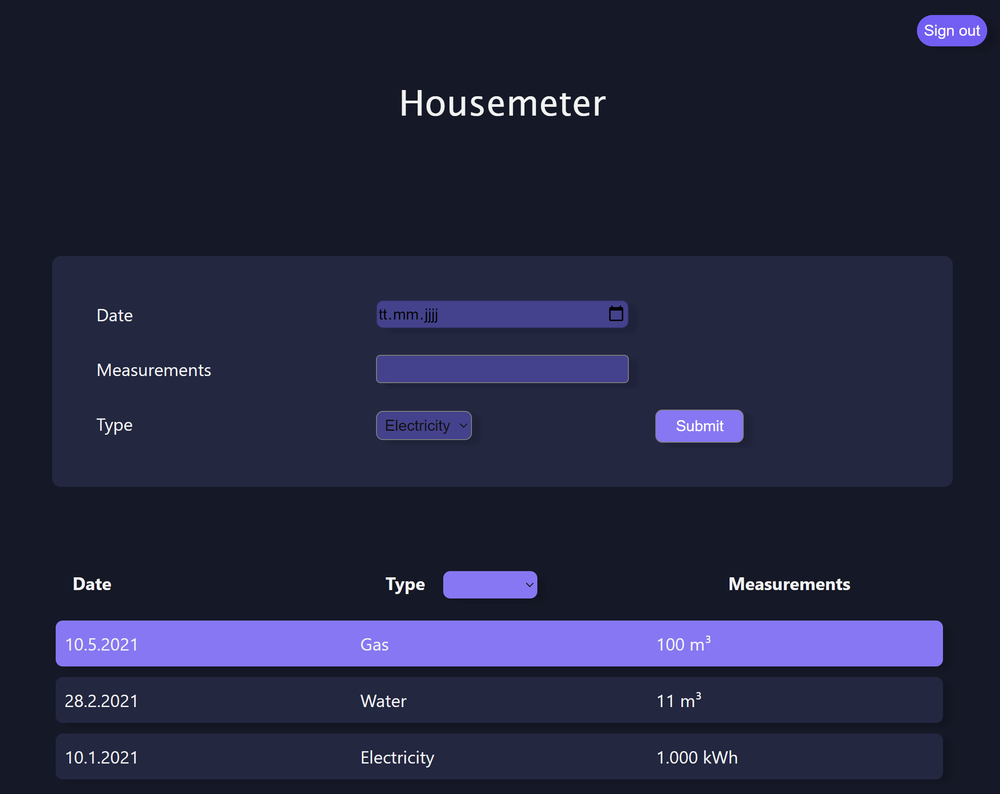

# housemeter

Housemeter is a tool to archive and evaluate all meter readings in the house.

## How I use housemeter

- you can filter the measurements types with the dropdown
- you can add new measurements
- you can filter the mearurementss

## It look like this

## deployment

It builds and runs on Netlify: https://houseinstallatioinsinc.netlify.app
